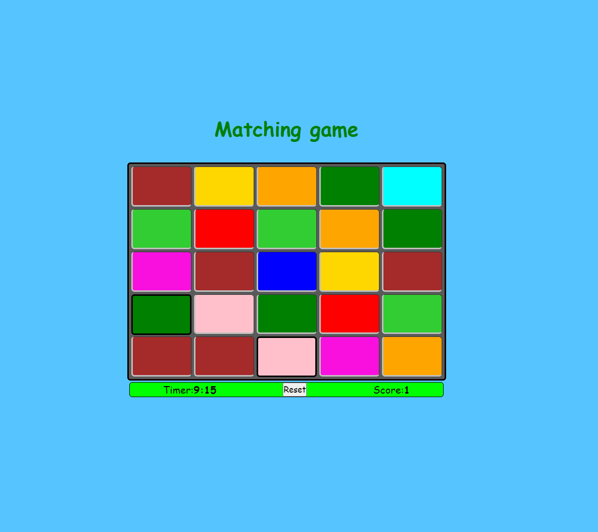

# Matching Colors Game
A simple board game with timer and scores

### Rules
Rearrange the matching colors to order them next to each other, creating three cells of the same color either horizontally or vertically.
### Getting Started
You can clone or download the repo and open index.html to view the game.

### Technologies Used
I used Javascript, HTML, and CSS without any third-party libraries to create this game.
